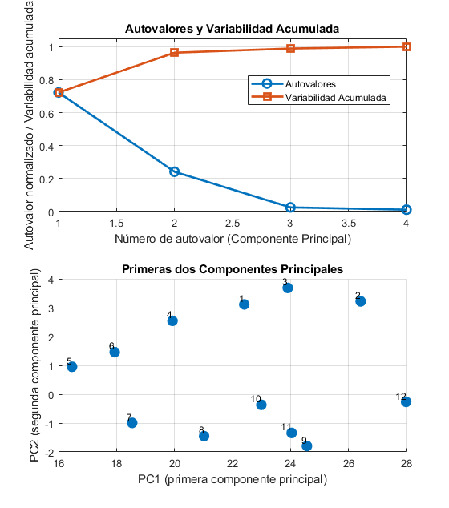
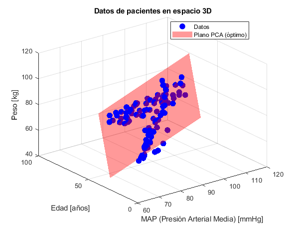
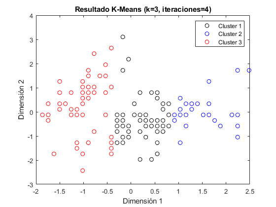

# aprendizaje-no-supervisado

Repositorio con ejercicios y prácticas del curso **Introducción al Aprendizaje No Supervisado**, dictado por el Dr. Ariel Pascaner. 

Este proyecto contiene la implementación de dos algoritmos fundamentales de aprendizaje no supervisado:

- **K-Means**: algoritmo de clustering que agrupa datos en k clusters basándose en la distancia euclidiana
- **PCA (Análisis de Componentes Principales)**: técnica de reducción de dimensionalidad para análisis exploratorio de datos

## Algunas outputs generadas

1. **Dataset de corredores**
    <p align="left">
    
    </p>
    *Generado por `corredores.m`*

2. **Análisis 3D de pacientes**
    <p align="left">
    
    </p>
    *Generado por:** `pacientes_3d.m`*

3. **K-Means de Iris**
    <p align="left">
    
    </p>
    *Generado por:** `iris.m`*

## Estructura del proyecto
```
aprendizaje-no-supervizado/
├── algoritmos/                  % Implementaciones de algoritmos
│   ├── PCA.m
│   └── k_means.m
│
├── data/                        # Archivos de datos
│   ├── pacientes.txt
│   ├── Iris.csv
│   └── corredores.txt
│
├── pacientes/                   % Ejercicio de pacientes
│   ├── cargar_pacientes.m 
│   ├── pacientes_3d.m 
│   └── pacientes.m
│
├── corredores/                  % Ejercicio de corredores
│   ├── cargar_corredores.m
│   └── corredores.m
│
├── corredores/                  % Ejemplo de iris
│   ├── cargar_iris.m
│   └── iris.m
│
├── images/                      % Gráficos
│   ├── output_corredores.png
│   ├── output_iris.png
│   └── output_pacientes_3d.png
│
├── README.md                    % Usted está aquí jaja
└── take_notes.pdf               % Mis notas y apuntes teóricos del curso
```